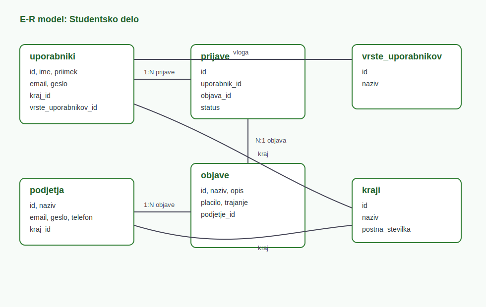

# Dokumentacija projekta Studentsko delo

## Predstavitev projekta

Studentsko delo je spletna aplikacija za povezovanje studentov in podjetij. Studentom omogoca pregled studentskih del, prikaz podrobnosti oglasa, prijavo na oglas in spremljanje statusa prijave. Podjetjem omogoca registracijo, prijavo, objavo oglasov, urejanje oglasov in obravnavo prijav kandidatov. Administrator ima locen prijavni obrazec in pregled glavnih entitet sistema.

Projekt temelji na client-server arhitekturi. Frontend skrbi za uporabniski vmesnik in klice na API, backend pa vsebuje poslovno logiko, preverjanje podatkov in komunikacijo z bazo.

## Nacrtovanje aplikacije

### Nacrt spletne strani

Navigacija je razdeljena glede na vlogo uporabnika:

- Student uporablja glavno stran z iskalnikom del, podrobnosti oglasa in prijavo na oglas.
- Podjetje uporablja loceno prijavo in nadzorno plosco za oglase ter prijave kandidatov.
- Administrator uporablja loceno admin prijavo in CRUD pregled glavnih podatkov.

Glavne strani so `index.html`, `prijava.html`, `registracija-student.html`, `registracija-podjetje.html`, `prijava-podjetje.html`, `podjetja-index.html`, `admin-prijava.html`, `admin.html`, `za-studente.html` in `za-podjetje.html`.

Oblikovna zasnova je enotna skozi aplikacijo: svetlo ozadje, zeleni poudarki, kartice za oglase in jasni obrazci.

## Nacrtovanje baze podatkov

### E-R model

### Opis entitet

- `uporabniki`: podatki o studentih in administratorju.
- `podjetja`: podatki o podjetjih.
- `objave`: oglasi za studentsko delo.
- `prijave`: prijave uporabnikov na oglase s statusom obravnave.
- `kraji`: sifrant krajev in postnih stevilk.
- `vrste_uporabnikov`: sifrant vlog uporabnikov.

### Relacije

- Eno podjetje ima lahko vec objav.
- Ena objava ima lahko vec prijav.
- En uporabnik ima lahko vec prijav.
- Uporabnik in podjetje sta povezana s krajem.
- Uporabnik je povezan z vrsto uporabnika.

## Tehnoloski sklad in orodja

### Tehnicne zahteve

- .NET SDK za zagon backend aplikacije.
- Node.js in npm za gradnjo frontenda.
- Dostop do zunanje PostgreSQL baze.
- Brskalnik za uporabo aplikacije.

### Uporabljena orodja

- Backend: .NET Core Web API, C#.
- Frontend: React, TypeScript, Vite.
- Baza: PostgreSQL na zunanjem gostitelju.
- ORM: Entity Framework Core.
- Verzijsko vodenje: Git in GitHub.
- Projektno vodenje: Trello.

### Zunanje komponente

- `Npgsql.EntityFrameworkCore.PostgreSQL`
- `Microsoft.EntityFrameworkCore.Tools`
- `Swashbuckle.AspNetCore`
- `Scalar.AspNetCore`
- `React`, `React DOM`, `TypeScript`, `Vite`

## Nacrt REST API koncnih tock

| Entiteta | Metoda | Pot | Namen |
| --- | --- | --- | --- |
| Oglasi | GET/POST/PUT/DELETE | `/api/JobOffer` | CRUD za oglase |
| Uporabniki | GET/POST/PUT/DELETE | `/api/Uporabnik` | CRUD za uporabnike |
| Podjetja | GET/POST/PUT/DELETE | `/api/Podjetje` | CRUD za podjetja |
| Kraji | GET/POST/PUT/DELETE | `/api/Kraj` | CRUD za kraje |
| Prijave | GET/POST/PUT/DELETE | `/api/Prijava` | CRUD za prijave |
| Vrste uporabnikov | GET/POST/PUT/DELETE | `/api/VrstaUporabnika` | CRUD za vloge |
| Admin | POST | `/api/Admin/login` | Prijava administratorja |

Dodatne poti: `/api/Auth/register`, `/api/Auth/login`, `/api/Podjetje/register`, `/api/Podjetje/login`, `/api/Prijava/podjetje/{podjetjeId}`, `/api/Prijava/uporabnik/{uporabnikId}` in `/api/Prijava/{id}/status`.

## Postopek razvoja in testiranje

Razvoj je potekal po vertikalah. Za posamezno entiteto so bili urejeni model, povezava z bazo, API kontroler in uporabniski prikaz.

Testiranje:

- `npm run build` za React frontend.
- `dotnet build Backend/Studentski_servis.csproj` za backend.
- Rocni pregled glavnih strani v brskalniku.
- Test registracije in prijave studenta.
- Test registracije in prijave podjetja.
- Test dodajanja, urejanja in brisanja oglasa.
- Test prijave studenta na oglas.
- Test sprejema in zavrnitve prijave pri podjetju.
- Test locene admin prijave.

## Povezava do Git

GitHub repozitorij: https://github.com/magda3424121/Studentsko_delo

## Navodila za uporabo

1. Student odpre glavno stran, pregleda oglase in uporabi filtre.
2. Pri oglasu klikne `Prikazi podrobnosti`, kjer vidi dodatne podatke.
3. Po prijavi lahko student odda prijavo na oglas in spremlja status.
4. Podjetje se prijavi in upravlja svoje oglase.
5. Podjetje lahko prijave kandidatov sprejme ali zavrne.
6. Administrator se prijavi prek locene admin strani in ureja glavne podatke.

## Zakljucek in samoevalvacija

Aplikacija izpolnjuje osnovne zahteve naloge: uporablja client-server arhitekturo, poslovna logika je na backendu, frontend je izdelan v Reactu s TypeScriptom, podatki pa so shranjeni v PostgreSQL bazi. Pri nadaljnjem razvoju bi bilo smiselno dodati varno hranjenje gesel z zgoscevanjem, JWT avtorizacijo in avtomatske teste.
